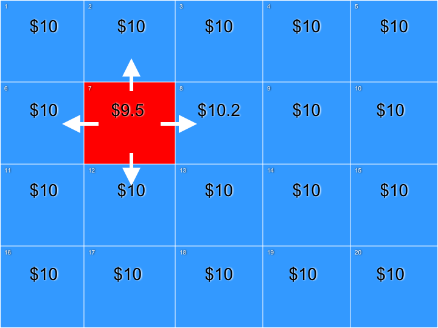
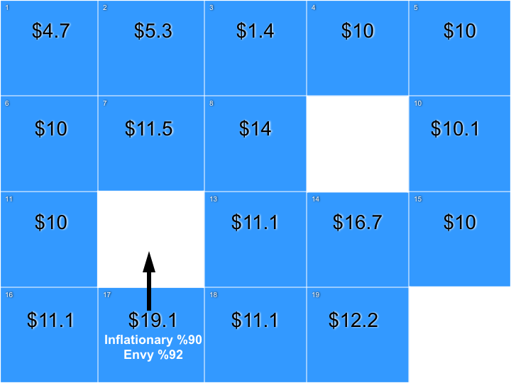

# PrisonersDilemmaThesis
Iterated prisoners dilemma in C++. Agents percieve more loss than they actually have. I investigated to see if this creates cyclical stock market bubble like behavior. It doesn't.

## Procedure

"Players" (Simulated players) will play prisoners dilemma according to these payoffs.

People *feel* more loss from missing gain than from loss. So let the agents feel this loss as well.  

If players play to 'inflate' their stock price: they cooperate to simulate the creation of a market bubble. They inflate their assets with each trade, adding to their perception of gain.

So let's look at an example trade:

Players prepare their strategies.

One trade in the agent pool:

Trade with all nearest neighors:

Select the next agent and continue trading:

Conduct these trades through all agents.

Kill off a few agents, then allow the most successful agents to replicate their strategy.

## Results

While we initially expected the models to cycle, they instead stablized. Here we graph all the strategies found at each different payout.

The only bubble-like behavior is near the boundary between two strategies:

## Questions? Reach out!

